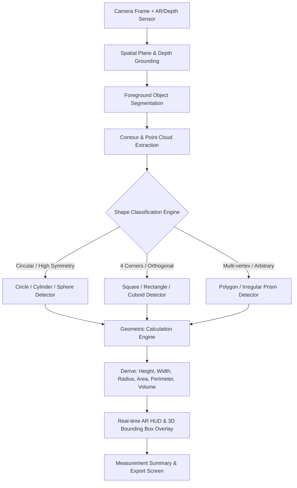
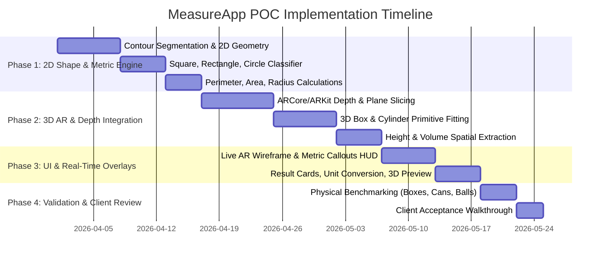

# Proof of Concept (POC) Specification Document
## Intelligent 3D/2D Object Scanning, Automated Shape Recognition & Dimensional Measurement Engine

**Project:** MeasureApp  
**Document Version:** 1.0 (Client Presentation Draft)  
**Date:** March 2026  
**Target Platforms:** iOS (ARKit / LiDAR) & Android (ARCore / Depth API)  
**Technology Stack:** React Native (Expo SDK 57), Native AR Modules (ARKit/ARCore), Computer Vision & On-Device ML  

---

## 1. Executive Summary

### 1.1 Project Vision
The primary objective of **MeasureApp** is to deliver a frictionless, "point-and-scan" mobile experience. By pointing a smartphone camera at any real-world object, the application must:
1. **Automatically identify and classify the object’s geometric shape** (e.g., Square, Rectangle, Circle, Cube/Cuboid, Cylinder, Sphere, or Irregular Polygon).
2. **Automatically compute critical spatial and geometric dimensions**:
   - **Linear Dimensions:** Height, Width, Length/Depth
   - **Circular Metrics:** Radius and Diameter
   - **Boundary Metrics:** Perimeter and Circumference
   - **Surface & Sectional Metrics:** Base Area, Lateral Surface Area, Total Surface Area
   - **Volumetric Metrics:** Volume ($m^3$, $cm^3$, Liters, inches$^3$)
3. **Render Real-Time AR Overlays:** Project precise, live-tracking wireframes and dimensional callout annotations directly onto the physical object in camera view.

---

## 2. Evaluation of Current Codebase & Gap Analysis

An audit of the current codebase in `MeasureApp` reveals why the existing implementation does not satisfy the client's core vision:

| Feature / Capability | Current Implementation | Client Vision / Required Behavior | Status / Gap |
| :--- | :--- | :--- | :--- |
| **Shape Recognition** | **Manual Selection Required:** User must manually select the shape ("Box", "Cylinder", "Sphere", etc.) from a UI dropdown before measuring. | **Automated Classification:** Camera automatically detects and classifies whether the object is a square, rectangle, cylinder, circle, or irregular shape. | ❌ **Major Gap:** No computer vision classification pipeline is currently running. |
| **Object Scanning** | **Manual Anchor Placement:** User must align a crosshair and manually tap endpoints as they move around the object. | **Autonomous Real-Time Scanning:** System detects edges, planes, and contours continuously from camera frames and depth maps. | ❌ **Major Gap:** Relies on manual user tapping rather than automated edge/contour extraction. |
| **Geometric Metrics** | Only calculates basic $L \times W \times H$ or regular volume formulas. **No Perimeter, Radius, or Area metrics** are exposed in the core UI. | Computes **Height, Width, Area, Radius, Diameter, Perimeter, Circumference, and Volume**. | ❌ **Major Gap:** Missing essential mathematical and geometric outputs requested by client. |
| **Shape Coverage** | iOS has an experimental rectangle detector (`VNDetectRectanglesRequest`) limited to boxes. Android has no detector. | Cross-platform identification of **Squares, Rectangles, Circles, Cylinders, Cuboids, Spheres, and Prisms** on both iOS and Android. | ❌ **Major Gap:** Android is completely unassisted; iOS is hardcoded to box detection only. |
| **2D vs 3D Scanning** | Assumes 3D solids only (or manual 2D photo markup where user manually taps 4 points). | Seamless support for both **2D planar objects** (tiles, paper, frames, circular discs) and **3D volumetric objects** (cartons, cans, bottles, balls). | ❌ **Major Gap:** Lack of automated 2D planar contour analysis. |

> **Conclusion:** The current codebase is an interactive volume calculator requiring heavy manual input. To fulfill the client's requirements, the architecture must transition to an **Automated Computer Vision & AR Shape Inference Engine**.

---

## 3. Shape Classification & Metric Matrix

The proposed engine classifies objects into 2D and 3D primitives and computes full geometric properties:

```
                            ┌───────────────────────────────────┐
                            │    Live Camera & Depth Stream     │
                            └─────────────────┬─────────────────┘
                                              ▼
                            ┌───────────────────────────────────┐
                            │  Contour & Surface Segmentation   │
                            └─────────────────┬─────────────────┘
                                              ▼
                      ┌───────────────────────┴───────────────────────┐
                      ▼                                               ▼
         [ 2D Planar Geometries ]                         [ 3D Volumetric Solids ]
         ├─ Square                                        ├─ Cube
         ├─ Rectangle                                     ├─ Cuboid / Box
         ├─ Circle                                        ├─ Cylinder
         ├─ Ellipse                                       ├─ Sphere
         └─ Irregular Polygon                             └─ Extruded Polygon / Prism
```

### Detailed Metrics Output by Shape

| Shape Type | Geometric Family | Identification Criteria | Computed Outputs & Metrics |
| :--- | :--- | :--- | :--- |
| **Square** | 2D Planar | 4 vertices, interior angles $\approx 90^\circ$, aspect ratio $\approx 1.00 \ (\pm 0.05)$ | Side Length ($s$), Perimeter ($P = 4s$), Area ($A = s^2$), Diagonal ($d = s\sqrt{2}$) |
| **Rectangle** | 2D Planar | 4 vertices, interior angles $\approx 90^\circ$, aspect ratio $\neq 1.00$ | Length ($l$), Width ($w$), Perimeter ($P = 2l + 2w$), Area ($A = l \cdot w$), Diagonal ($d = \sqrt{l^2 + w^2}$) |
| **Circle** | 2D Planar | Isoperimetric circularity quotient $Q \approx 1.00$, uniform radial variance | Radius ($r$), Diameter ($d = 2r$), Circumference / Perimeter ($C = 2\pi r$), Area ($A = \pi r^2$) |
| **Ellipse** | 2D Planar | Smooth closed contour, 2 orthogonal axes of symmetry ($a \neq b$) | Major Radius ($a$), Minor Radius ($b$), Perimeter ($P \approx \pi [3(a+b) - \sqrt{(3a+b)(a+3b)}]$), Area ($A = \pi a b$) |
| **Cube / Box (Cuboid)** | 3D Volumetric | 6 rectangular faces, 12 right-angled edges, parallel bounding normals | Length ($l$), Width ($w$), Height ($h$), Base Perimeter ($2l+2w$), Base Area ($l \cdot w$), Total Surface Area ($2(lw+lh+wh)$), Volume ($V = l \cdot w \cdot h$) |
| **Cylinder** | 3D Volumetric | Circular top/bottom caps + continuous curved lateral surface with parallel axis | Radius ($r$), Diameter ($d$), Height ($h$), Base Circumference ($2\pi r$), Base Area ($\pi r^2$), Lateral Area ($2\pi r h$), Total Area ($2\pi r(r+h)$), Volume ($V = \pi r^2 h$) |
| **Sphere** | 3D Volumetric | Uniform radial distance from 3D centroid across all depth hit-points | Radius ($r$), Diameter ($d$), Great Circle Circumference ($2\pi r$), Surface Area ($4\pi r^2$), Volume ($V = \frac{4}{3}\pi r^3$) |
| **Irregular / Polygon** | 2D or 3D | $N$-vertex closed contour ($N \ge 5$) or non-standard cross-section | Bounding Box ($L \times W \times H$), Convex Hull, Multi-point Perimeter, Cross-Sectional Area (Shoelace), Extruded Volume |

---

## 4. Technical Architecture: How the Solution Works



### 4.1 Step 1: Spatial & Metric Grounding
To measure real physical units (centimeters, meters, inches) rather than screen pixels, the application uses:
- **LiDAR & ARKit (iOS):** Real-time scene depth and plane anchors.
- **ARCore Depth API (Android):** Raw depth maps and instant placement raycasts to convert pixel coordinates $(u, v)$ to real-world metric coordinates $(X, Y, Z)$ in meters.
- **Camera Intrinsics:** Focal length $(f_x, f_y)$ and principal points $(c_x, c_y)$ calibrate optical perspective.
- **Reference-Assisted Mode (Fallback for non-AR devices):** Uses a known standard reference (e.g., credit card, coin, or A4 paper) placed adjacent to the object to calculate the millimeter-per-pixel ratio.

### 4.2 Step 2: Automated Object Segmentation & Contour Extraction
Rather than requiring the user to mark corners manually:
1. **Depth Slicing & Plane Subtraction:** The application identifies the supporting surface (floor, table, desk) via AR plane detection and isolates the foreground object protruding above the surface.
2. **Edge & Contour Extraction:** Using an efficient on-device OpenCV or lightweight vision model (MobileSAM / YOLOv8-Nano / Apple Vision Contour), the object's outer boundary is segmented into a closed 2D polygon $P = \{(x_1, y_1), (x_2, y_2), \dots, (x_n, y_n)\}$.

### 4.3 Step 3: Automated Shape Classification Engine
The algorithm classifies the segmented boundary without user intervention:

1. **Circularity & Roundness Check:**
   $$\text{Circularity Quotient } Q = \frac{4\pi \cdot \text{Area}}{(\text{Perimeter})^2}$$
   - If $Q \ge 0.88$: The 2D projection is classified as **Circle**.
   - If a 3D height extrusion is detected above the circle, it is classified as a **Cylinder**.
   - If depth curvature is spherically symmetric across all axes, it is classified as a **Sphere**.

2. **Corner Simplification (Douglas-Peucker Algorithm):**
   - If $Q < 0.88$, polygon vertices are simplified with tolerance $\epsilon$:
   - If simplified vertices $= 4$:
     - Check interior angles $\theta_i \approx 90^\circ \ (\pm 10^\circ)$.
     - Compute edge lengths $s_1, s_2, s_3, s_4$.
     - Compute Aspect Ratio: $AR = \frac{\max(s_1, s_2)}{\min(s_1, s_2)}$.
     - If $0.92 \le AR \le 1.08$: Classified as **Square** (or **Cube** if 3D height $\approx$ base side).
     - If $AR > 1.08$: Classified as **Rectangle** (or **Cuboid / Box** if 3D height exists).
   - If simplified vertices $\ge 5$: Classified as **Polygon / Irregular**.

3. **3D Model Fitting (RANSAC Primitive Fitting):**
   - Point cloud points are fitted against geometric primitives (plane vs. cylinder vs. sphere) using minimal residual errors.

### 4.4 Step 4: Metric Calculation Engine
Once the shape is classified, the system computes the exact dimensional equations:
- **Perimeter of Closed Polygon:**
  $$P = \sum_{i=1}^{n} \sqrt{(x_{i+1} - x_i)^2 + (y_{i+1} - y_i)^2}$$
- **Area of Closed Polygon (Shoelace Formula):**
  $$A = \frac{1}{2} \left| \sum_{i=1}^{n} (x_i y_{i+1} - x_{i+1} y_i) \right|$$
- **Radius & Diameter (Least-Squares Circle Fit):**
  $$\min_{x_c, y_c, r} \sum_{i=1}^{n} \left( \sqrt{(x_i - x_c)^2 + (y_i - y_c)^2} - r \right)^2$$
- **Cylinder Metrics:**
  $$\text{Radius } r, \quad \text{Perimeter } C = 2\pi r, \quad \text{Base Area } A_b = \pi r^2, \quad \text{Volume } V = A_b \cdot h$$
- **Cuboid Metrics:**
  $$\text{Volume } V = l \cdot w \cdot h, \quad \text{Surface Area } SA = 2(lw + lh + wh)$$

---

## 5. User Experience & Screen Flow (Client Walkthrough)

```
┌────────────────────────┐      ┌────────────────────────┐      ┌────────────────────────┐
│  1. Live AR Scanner    │      │  2. Shape Recognized   │      │  3. Measurement Card   │
│                        │      │                        │      │                        │
│   [  Aim at Object  ]  │ ───► │  [ CYLINDER DETECTED ] │ ───► │ Shape: Cylinder (96%)  │
│   Scanning surface...  │      │  3D Bounding Mesh Live │      │ Height: 24.5 cm        │
│   Tracking stable  ✓   │      │  r = 6.2cm, h = 24.5cm │      │ Radius: 6.2 cm         │
│                        │      │                        │      │ Perimeter: 38.95 cm    │
│                        │      │                        │      │ Base Area: 120.76 cm²  │
│                        │      │                        │      │ Volume: 2.96 Liters    │
│  [  Auto-Capture  ]    │      │  [ Confirm / Adjust ]  │      │  [ Save to History ]   │
└────────────────────────┘      └────────────────────────┘      └────────────────────────┘
```

1. **Step 1: Point & Aim:** The user points the camera at the object on any desk, floor, or table. The app provides visual feedback (green tracking points, plane grid).
2. **Step 2: Instant Classification:** The app highlights the object contour in real-time, displays a badge (e.g., *"Detected: Cylinder • Confidence 96%"*), and draws a 3D wireframe around the object.
3. **Step 3: Live Metric Callouts:** Dimension lines with dynamic metric tags float around the object showing **Height, Width/Diameter, Perimeter, Area**.
4. **Step 4: Detailed Breakdown:** Tapping "Inspect" opens a rich metric breakdown card with unit toggling (cm, m, in, ft, liters, gallons) and an interactive, rotatable 3D model view.

---

## 6. Implementation Roadmap & Milestones

To deliver this client POC efficiently and demonstrate working capabilities incrementally, the implementation is organized into four key milestones:



### Phase 1: 2D Planar Shape Classification & Metrics (Immediate Milestone)
- **Goal:** Real-time camera detection for flat/planar objects on a surface.
- **Deliverables:**
  - Automated detection of **Square**, **Rectangle**, **Circle**, **Ellipse**, and **Polygon**.
  - Computation of **Height**, **Width**, **Radius**, **Perimeter**, and **Area**.
  - Visual bounding contour and dimension tags on camera screen.

### Phase 2: 3D Volumetric Primitives & Depth Extraction
- **Goal:** Automatically measure 3D solids using AR depth and plane separation.
- **Deliverables:**
  - Automated identification of **Boxes/Cuboids**, **Cylinders**, and **Spheres**.
  - Metric extraction of **Height**, **Diameter/Radius**, **Base Area**, **Lateral Area**, and **Volume**.
  - Cylinder vs. Box disambiguation based on top-cap circularity and side curvature.

### Phase 3: AR HUD Overlays & Interactive Result Studio
- **Goal:** Premium user interface matching client expectations.
- **Deliverables:**
  - Floating AR dimension labels anchored in 3D space.
  - Interactive 3D wireframe inspection view.
  - Multi-unit conversion ($cm \leftrightarrow in$, $m^3 \leftrightarrow liters$).
  - Scan history and export (PDF / CSV / JSON report).

### Phase 4: Accuracy Benchmarking & Tolerance Verification
- **Goal:** Ensure measurable, reliable precision against physical ground truths.
- **Deliverables:**
  - Calibration test suite with known ground-truth physical benchmarks (standard soda can, shipping box, tennis ball).
  - Accuracy report showing measurement deviations and confidence intervals.

---

## 7. Accuracy Benchmarks & Operational Guidelines

| Metric | Target Accuracy (LiDAR / AR Depth) | Target Accuracy (Standard Camera + Reference) | Optimal Operating Distance |
| :--- | :--- | :--- | :--- |
| **Linear (Height, Width)** | $\pm 2.0\% - 3.5\%$ | $\pm 3.0\% - 5.0\%$ | 0.3 m to 1.5 m |
| **Radius / Diameter** | $\pm 2.5\% - 4.0\%$ | $\pm 3.5\% - 6.0\%$ | 0.3 m to 1.2 m |
| **Perimeter / Circumference**| $\pm 2.5\% - 4.5\%$ | $\pm 4.0\% - 6.0\%$ | 0.3 m to 1.2 m |
| **Surface Area** | $\pm 4.0\% - 6.0\%$ | $\pm 5.0\% - 8.0\%$ | 0.3 m to 1.2 m |
| **Volume** | $\pm 5.0\% - 8.0\%$ | $\pm 8.0\% - 12.0\%$ | 0.3 m to 1.2 m |

### Best-Practice Scanning Conditions
1. **Lighting:** Even, diffuse lighting ($\ge 300$ lux). Avoid harsh glare, specular reflections, or deep shadows.
2. **Background Surface:** Contrast between the object and the resting surface (e.g., dark object on light table) ensures crisp contour isolation.
3. **Surface Properties:** Matte, opaque surfaces provide the highest accuracy. Transparent glassware or mirror finishes require guided boundary assist.

---

## 8. Summary for Client Presentation

1. **Alignment with Client Goal:** The updated design replaces manual point selection with an **automated shape recognition and dimensional calculation engine**.
2. **Comprehensive Metric Suite:** Generates **Height, Width, Area, Radius, Perimeter, Circumference, and Volume** in one unified scan.
3. **Cross-Platform Readiness:** Designed for modern iOS and Android smartphones leveraging ARCore, ARKit, and on-device computer vision.
4. **Transparent Roadmap:** Clear 4-phase rollout ensuring an interactive prototype can be demonstrated to stakeholders quickly.
